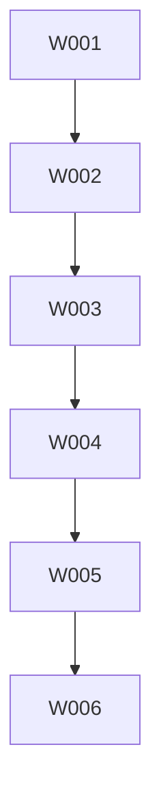

Ja — **100%**. Det er faktisk den næste oplagte evolution af WDD.

Du har allerede dependencies i frontmatter:

```yaml
dependencies: [1, 2, 3, 4, 5]
```

Det betyder, at WDD allerede har begyndelsen på en **DAG**: directed acyclic graph. Og når du har en DAG, kan du beregne:

* hvilke Wards er blocked
* hvilke Wards er ready
* hvilke kan køres parallelt
* hvilke ligger på critical path
* hvilke er risky integration points
* hvilke sub-agents kan arbejde uden at træde hinanden over tæerne

Det ville give kæmpe værdi.

## Den vigtigste idé

Tilføj et WDD-command som:

```bash
wdd plan
```

eller:

```bash
wdd parallel
```

Som printer noget ala:

```txt
Ready now:
  Ward 006 — Manifest Validation Command
  Ward 025 — Basic Documentation

Blocked:
  Ward 008 — Dev Server
    waits for: 007
  Ward 011 — DOM Renderer
    waits for: 010

Parallel batches:
  Batch A:
    006 Manifest Validation Command
    025 Basic Documentation

  Batch B:
    007 CLI Create Command
    013 Speaker Notes
```

Og måske endnu vigtigere:

```txt
Safe to outsource:
  Ward 025 — Docs
  Ward 026 — Basic Example
  Ward 029 — Accessibility docs

Needs architect review:
  Ward 010 — Runtime State and Navigation
  Ward 016 — Timeline Scheduler
  Ward 019 — Three.js Renderer
```

## Det bør ikke bare være “dependencies”

Dependencies er nødvendige, men ikke nok.

For parallelisering skal WDD også vide noget om **resource conflicts**.

Eksempel:

Ward 006 og Ward 007 kan begge røre `packages/cli/src/index.ts`.

Så selv hvis dependencies siger, at de kan køre parallelt, kan de stadig konflikte i Git.

Jeg ville udvide Ward frontmatter med noget i denne stil:

```yaml
parallel_safe: true
touches:
  - packages/compiler/**
  - packages/cli/**
provides:
  - compiler.validateDeck
  - cli.validate
requires:
  - compiler.compileDeck
  - compiler.compileMarkdownDeck
risk: medium
review: strict
```

Eller mere kompakt:

```yaml
workstreams:
  - compiler
  - cli
touches:
  - packages/compiler/**
  - packages/cli/**
```

Så kan WDD sige:

> Disse to Wards er dependency-uafhængige, men de rammer samme files/workstream, så de bør ikke køres parallelt uden branch isolation.

## Jeg ville indføre tre parallelitetsniveauer

### 1. Dependency-ready

Kan startes fordi dependencies er complete.

```txt
ready = all dependencies complete
```

### 2. Conflict-safe

Kan køres parallelt uden sandsynlige merge conflicts.

```txt
no overlap in touches/workstreams
```

### 3. Review-safe

Kan uddelegeres til en sub-agent uden høj arkitekturrisiko.

```txt
risk low/medium + no core architecture boundary
```

Det giver en mere intelligent plan end bare “alle unblocked Wards”.

## Eksempel: Deckforge lige nu

Når Ward 006 er færdig, kunne parallel plan måske sige:

```txt
Strict sequential:
  007 CLI Create Command
  008 Dev Server
  009 Build and Preview
  010 Runtime State and Navigation
  011 DOM Renderer

Parallel candidates:
  025 Basic Documentation
  026 Basic Example skeleton
  029 Accessibility requirements draft

Do not parallelize yet:
  010 Runtime State and Navigation
  016 Timeline Scheduler
  019 Three.js Renderer
```

Fordi runtime/renderer-wards skaber grundarkitektur. Dem vil man ikke have tre sub-agents til at gætte på samtidigt. Så får man en hydra med `any`.

## Nye WDD commands jeg ville bygge

### `wdd graph`

Printer dependency graph.

```bash
wdd graph
```

Output:

```txt
001 Repository Scaffold
 └─ 002 Core Types
     └─ 003 Builder API
         └─ 004 TS Compiler
             └─ 005 Markdown Compiler
                 └─ 006 Validation Command
```

Måske også:

```bash
wdd graph --format mermaid
```



### `wdd ready`

Viser Wards der kan startes nu.

```bash
wdd ready
```

### `wdd parallel`

Viser batches.

```bash
wdd parallel
```

Output:

```txt
Parallel batch 1:
  006 Manifest Validation Command [compiler, cli]
  025 Docs: Getting Started [docs]

Parallel batch 2:
  007 CLI Create Command [cli]
  026 Basic Example [examples]
```

### `wdd critical-path`

Viser længste afhængighedskæde.

```bash
wdd critical-path
```

Det er super værdifuldt for at finde, hvad man ikke må blokere.

### `wdd assign`

Genererer prompt til sub-agent.

```bash
wdd assign 025 --agent claude
```

Outputter en agent-klar task:

```txt
You are assigned Ward 025.
Run wdd session.
Only work on docs/**.
Do not edit packages/core/**.
Stop at Gold.
Report verification.
```

Det er guld.

## Det vigtigste: branch/lock model

Hvis du vil køre sub-agents parallelt, bør WDD have et simpelt lock-system.

Eksempel:

```bash
wdd ward claim 025 --agent docs-agent
```

Det skriver måske:

```yaml
status: claimed
claimed_by: docs-agent
claimed_at: 2026-05-03T...
```

Eller en separat fil:

```txt
.wdd/locks/ward-025.lock
```

Med:

```json
{
  "ward": 25,
  "agent": "docs-agent",
  "touches": ["docs/**"],
  "created": "..."
}
```

Så `wdd parallel` kan advare:

```txt
Ward 026 conflicts with active lock:
  docs/** claimed by docs-agent for Ward 025
```

Meget simpelt. Meget nyttigt.

## WDD frontmatter v2 forslag

Jeg ville udvide Ward template sådan her:

```yaml
ward: 6
revision: null
name: "Manifest Validation Command"
epic: "compiler-validation"
status: planned
dependencies: [1, 2, 3, 4, 5]
layer: "cli/compiler"
estimated_tests: 9
created: "2026-05-03"
completed: null

# WDD v2 planning metadata
risk: medium
review_mode: strict
parallel_safe: false
workstreams:
  - compiler
  - cli
touches:
  - packages/compiler/**
  - packages/cli/**
provides:
  - compiler.validateDeck
  - cli.deckforge.validate
requires:
  - compiler.compileDeck
  - compiler.compileMarkdownDeck
```

For docs Ward:

```yaml
risk: low
review_mode: accelerated
parallel_safe: true
workstreams:
  - docs
touches:
  - docs/**
provides:
  - docs.getting-started
requires: []
```

For runtime:

```yaml
risk: high
review_mode: strict
parallel_safe: false
workstreams:
  - runtime
touches:
  - packages/runtime/**
  - packages/core/**
provides:
  - runtime.controller
requires:
  - core.manifest
```

## Review modes bør være first-class

Det hænger direkte sammen med det du spurgte om før.

```yaml
review_mode: strict
```

Betyder:

```txt
planned -> red STOP
red -> approved -> gold STOP
gold -> complete STOP
```

```yaml
review_mode: accelerated
```

Betyder:

```txt
planned -> red -> approved -> gold in one agent run
STOP before complete
```

```yaml
review_mode: autonomous
```

Kun for low-risk docs/formatting:

```txt
agent may complete, but must create review report
```

Jeg ville være meget forsigtig med autonomous, men det kan give mening for docs eller generated examples.

## Parallel execution policy

Du kan få WDD til at sige:

```txt
A Ward may be parallelized if:
  - all dependencies are complete
  - status is planned
  - risk is low or medium
  - parallel_safe is true
  - no active lock overlaps its touches
  - no planned peer in same batch has overlapping touches
```

Og:

```txt
A Ward must be sequential if:
  - risk is high
  - review_mode is strict
  - touches core architecture files
  - provides an API consumed by many later Wards
```

## Det ville gøre WDD meget mere værdifuldt

Lige nu WDD er:

> “Hvordan undgår vi at agenten bygger noget forkert?”

Med parallel plan bliver WDD også:

> “Hvordan bruger vi flere agenter uden at skabe kaos?”

Det er en naturlig næste fase.

## Jeg ville lave det som en ny Epic i WDD-frameworket

For dit `wdd` framework kunne en roadmap være:

### Ward A — Dependency Graph

* parse all ward frontmatter
* build DAG
* detect missing deps
* detect cycles
* `wdd graph`

### Ward B — Ready Queue

* `wdd ready`
* list planned Wards whose dependencies are complete
* show blocked reason

### Ward C — Parallel Batches

* compute batches/topological levels
* group by no overlapping workstreams/touches
* `wdd parallel`

### Ward D — Planning Metadata

* extend ward template
* validate `risk`, `review_mode`, `touches`, `workstreams`
* update `wdd validate`

### Ward E — Agent Assignment

* `wdd assign <ward>`
* generate sub-agent prompt
* optional `--mode strict|accelerated`
* optional `--agent claude|codex|cursor`

### Ward F — Locks

* `wdd claim`
* `wdd release`
* lock conflict detection
* stale lock warning

## MVP-versionen kunne være meget simpel

Start med kun dependencies:

```bash
wdd ready
wdd graph
```

Så tilføj:

```bash
wdd parallel
```

Og først derefter `touches`/locks.

Du behøver ikke bygge Kubernetes for AI-goblins i første hug.

## Konklusion

Ja. Det ville give **meget** værdi.

Især fordi WDD’s store force er at gøre AI-arbejde eksplorérbart, reviewbart og kontrollerbart. Parallel planning er samme filosofi, bare på team/agent-niveau.

Mit hot take:

> WDD v1 er test-first projektstyring for én agent.
> WDD v2 bør være dependency-aware orchestration for mange agenter.

Og Deckforge er faktisk et perfekt testprojekt til at opdage præcis hvor grænsen går mellem “parallel productivity” og “merge-conflict clown car.”


Ja — det kan give **meget** mening. Men kun på de rigtige typer opgaver.

Det er ikke automatisk en klovnebus. Det er mere sådan:

> Flere agenter på samme opgave er genialt til design space exploration.
> Flere agenter på samme simple CRUD-implementering er bare tre klovne med samme skruetrækker.

## Hvornår det giver værdi

Det giver især mening, når opgaven har **flere plausible løsninger**, og hvor “bedst” ikke bare betyder “tests passer”.

Eksempler hvor multi-agent tournament giver mening:

### 1. Arkitekturvalg

Fx:

* hvordan skal plugin-systemet designes?
* hvordan skal timeline scheduler API se ud?
* hvordan skal runtime state/nav abstraheres?
* hvordan skal Markdown directives repræsenteres i manifestet?
* hvordan skal renderer lifecycle se ud?

Her kan du sende 2-3 agenter ud med samme problem og bede dem levere hver sit forslag. QA-agenten/human vælger eller syntetiserer.

Det er værdifuldt, fordi arkitekturfejl er dyre.

### 2. Public API design

Eksempel:

```ts
deck({
  slides: [slide("intro")]
})
```

versus fluent API:

```ts
deck().slide("intro").build()
```

versus file-based conventions.

Her er det godt at få flere bud, fordi API ergonomics er smag + konsekvens + fremtidig maintainability.

### 3. Kompleks bugfix

Hvis en test fejler på en mystisk måde, kan flere agenter foreslå forskellige root causes. QA-agenten vælger den mindst invasive patch.

### 4. Performance/algorithmic arbejde

Fx timeline scheduler, layout engine, graph batching i WDD, asset resolver.

Flere agenter kan lave forskellige tradeoffs:

* simpel løsning
* robust løsning
* hurtig løsning
* mere type-safe løsning

### 5. UI/UX/visual concepts

Når Deckforge når renderer/theme/example-fasen, er multi-agent rigtig god:

* agent A laver clean corporate renderer demo
* agent B laver dark carnival demo
* agent C laver spatial architecture walkthrough

Så vælger man vibe og implementation.

## Hvornår det er klovnebus

Det er spild, når opgaven er:

* meget lille
* meget entydig
* allerede godt specificeret
* primært mekanisk
* lav risiko
* let at teste objektivt

Eksempler:

* tilføj en eksport
* ret package.json
* lav en simpel CLI flag parser
* skriv én validation check
* opdater README for en kendt kommando
* implementér testens forventede shape direkte

Der er det bedre med én agent + tests.

## Den bedste model: “N-agent proposals, 1 implementation”

Jeg ville **ikke** som default lade tre agenter implementere i samme repo og så vælge et diff. Det bliver hurtigt merge-conflict-cirkus.

Bedre:

### Fase 1: Flere agents laver proposals

De må ikke ændre main workspace. De skal levere:

* approach
* API shape
* files touched
* risks
* test plan
* maybe pseudocode
* tradeoffs

### Fase 2: QA/human vælger eller syntetiserer

QA-agenten laver:

```txt
Proposal A is simplest but misses X.
Proposal B has best architecture but overbuilds Y.
Proposal C has strongest test strategy.

Recommended synthesis:
- use B's API
- use A's implementation simplicity
- add C's tests
```

### Fase 3: Én implementation-agent bygger

Så undgår du tre konkurrerende diffs.

Det er nok den bedste standardmodel.

## Hvornår parallel implementation giver mening

Der er dog situationer, hvor du godt kan lade flere implementere samme Ward i isolerede branches/worktrees.

Det giver mening når:

* Ward er high-risk
* output er stort
* løsningen kan bedømmes objektivt med tests + review
* du kan køre dem i separate git worktrees
* QA kan sammenligne diffs

Eksempel:

```bash
git worktree add ../deckforge-agent-a -b ward-010-a
git worktree add ../deckforge-agent-b -b ward-010-b
git worktree add ../deckforge-agent-c -b ward-010-c
```

Så hver agent arbejder isoleret. QA sammenligner.

Men det bør være undtagelsen, ikke normen.

## WDD feature-idé: `wdd contest`

Du kunne faktisk bygge det ind i WDD-frameworket.

```bash
wdd contest 010 --agents 3 --mode proposal
```

Output:

```txt
Contest: Ward 010 Runtime State and Navigation

Agent A: simple reducer architecture
Agent B: class-based RuntimeController
Agent C: event-sourced state machine

QA recommendation:
  Use Agent B's public API,
  Agent A's internal reducer,
  Agent C's event tests.
```

Eller:

```bash
wdd contest 016 --agents 3 --mode implementation
```

Men implementation mode bør kræve:

```yaml
contest_safe: true
```

eller high-risk explicit approval.

## QA-agent rubric

Hvis du vil have en QA-agent til at vælge, skal den ikke bare sige “A is best vibes”.

Den skal score efter rubric:

```txt
Correctness:       0-5
Test coverage:     0-5
Simplicity:         0-5
Architecture fit:  0-5
API ergonomics:    0-5
Maintainability:   0-5
Risk:              low/medium/high
Spec compliance:   pass/fail
```

Og vigtigst:

```txt
Disqualifiers:
- violates Must NOT
- changes tests to pass implementation
- introduces broad dependency without approval
- crosses package boundaries incorrectly
- hides errors
- mutates inputs unexpectedly
```

For Deckforge bør QA-agenten især tjekke:

* core stays environment-neutral
* compiler stays Node-only
* runtime doesn’t leak into compiler
* renderer doesn’t leak into core
* public APIs stay serializable and manifest-first
* no surprise dependencies
* no package-tree cache poop

## Hvilke Wards i Deckforge egner sig til contest?

### Gode contest-kandidater

* **Ward 010 — Runtime State and Navigation**
* **Ward 016 — Timeline Scheduler**
* **Ward 018 — Camera Abstraction**
* **Ward 019 — Three.js Renderer**
* **Ward 020 — Effect Layer Primitives**
* **Ward 024 — Export Screenshots/PDF**
* Plugin architecture Wards, hvis de kommer

Her er der mange designvalg, og fejl bliver dyre.

### Dårlige contest-kandidater

* **Ward 006 — Manifest Validation Command**
* **Ward 007 — CLI Create Command**
* **Ward 009 — Build/Preview**
* Simple docs/examples
* Small parser extensions

Her er én agent nok.

## Min anbefaling til WDD v2

Tilføj `strategy` i Ward frontmatter:

```yaml
execution_strategy: single
```

Mulige værdier:

```yaml
execution_strategy: single
execution_strategy: parallel-proposals
execution_strategy: parallel-implementations
```

Og måske:

```yaml
contest_agents: 3
qa_required: true
```

Eksempel for Runtime:

```yaml
ward: 10
name: "Runtime State and Navigation"
risk: high
review_mode: strict
execution_strategy: parallel-proposals
contest_agents: 3
```

Eksempel for validation:

```yaml
ward: 6
name: "Manifest Validation Command"
risk: medium
review_mode: accelerated
execution_strategy: single
```

## Det vigtigste princip

Brug flere agenter til at udforske **uklarhed**, ikke til at gentage **klarhed**.

Hvis opgaven er klart defineret og testbar:

> én agent + tests.

Hvis opgaven er designmæssigt åben:

> flere agents + QA synthesis.

Hvis opgaven er high-risk og implementationen kan variere meget:

> flere isolated implementations + QA diff review.

## Konklusion

Nej, det er ikke bare en klovnebus.

Men det bliver en klovnebus, hvis man bruger det ukritisk.

Mit take:

> Multi-agent contest er ikke en hastigheds-feature.
> Det er en beslutningskvalitets-feature.

Brug det på de Wards hvor en forkert arkitektur koster dyrt. Ikke på de Wards hvor agenten bare skal skrue en hylde op.
